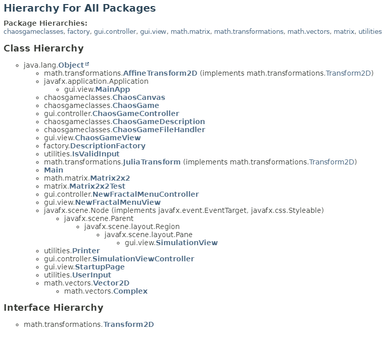

## Gruppe 13 sin mappevurdering i IDATG2003
Mappen er knyttet til en mappevurdering i emne IDATG2003. Oppgaven
for vurderingen gikk ut på å sette opp et såkalt Chaos Game hvor man kan lage
forskjellige fraktaler basert på transformasjoner.
Prosjekt perioden er delt i 3-deler, den første delen dreier seg om å sette sammen
regneopperasjonene som trengs for å utføre fraktalene. Den andre delen handler
om å reprensentere fraktalene ved å ta i bruk regneopperasjonene fra forgje del til
å opprette et chaos game. Disse verdiene skal både skrives og leses fra en fil ved
hjelp av en filbehandler. I den tredje og siste delen av oppgaven skal man sette
opp dette kaos spillet som har blit satt opp i en GUI opprettet ved bruk av Java


## Hvordan kjøre prorammet
1. Last ned/Klon prosjektet fra GitLab
2. Opprett prosjektet i en IDE som støtter Java
3. Ha maven installert på maskinen eller i IDE-en
4. Kjør "mvn javafx:run" i terminalen eller kjør i IDE-en

## Zoom + Skalere lerretet i programmet
For å skalere lerretet i programmet kan man bruke scrollhjulet på musen for å zoome inn. Ellers så kan man endre max og min verdiene til fraktalen ved å bruke "zoom" slideren i programmet.

## Klasse hierarki
Følgende er en oversikt over klassene i prosjektet og deres relasjoner:




## Hvordan kjøre testene
Utnytt maven til å kjøre testene ved å skrive.
Enten ved bruk av mvn test i terminalen eller kjør testene i din IDE

## GitHub repository
Link til GitHub repositoriet finner du ved [GitHub repository](https://github.com/NikolaiToonder/idatg2003.gr13.chaosGame)

<a href="https://github.com/NikolaiToonder/idatg2003.gr13.chaosGame">
  
</a>

## Alternativ måte å kjøre prosjektet

For å kjøre prosjektet, kan du bruke følgende Bash-script fra din IDE:

```bash
# Kjør prosjektet med JavaFX
mvn javafx:run
